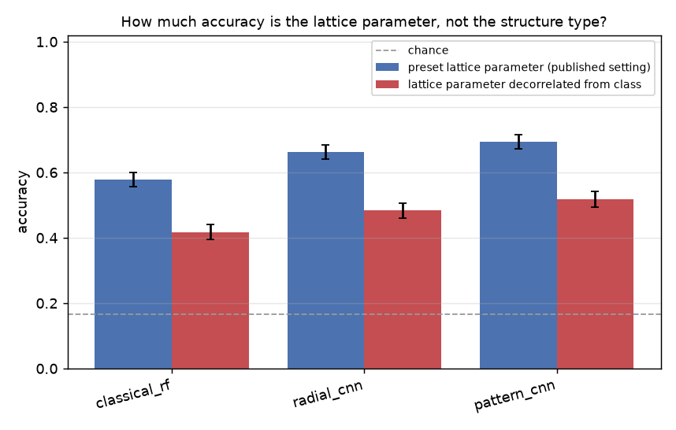

# diffraction-structure-classifier

Identify the crystal structure type behind a simulated electron diffraction
pattern. The repository ships a kinematical diffraction simulator with exact
ground truth, three classifiers on three different views of the same pattern (a
fair-tuned classical baseline, a 1D CNN on the radial profile, and a 2D CNN on a
rotation-invariant polar-Fourier map), and a config-driven benchmark that
measures which representation wins, where each one fails, and how much of the
accuracy is real structure-type information rather than a shortcut. Every
comparison carries a 95% confidence interval and a paired significance test, and
every committed number regenerates from a fixed-seed YAML config on CPU.

This is a reciprocal-space project. The data are diffraction patterns, not
real-space micrographs, and the task is classification, not detection.





## Headline results

Full tables and readings in [RESULTS.md](RESULTS.md); raw values in
`results/*.json`. Chance is 1/6 = 0.167. Every number below was measured this
session on 1800 test patterns with fixed seeds, and every ordering claim is
backed by a paired McNemar test, not a bare point estimate.

**1. Learned representations beat the classical baseline, and the ordering is
significant.** At a moderate operating point (dose 40, tilt scale 3 degrees, 85%
of reflections kept, n = 1800), the 2D polar-Fourier CNN leads, the 1D radial CNN
is second, and the engineered-feature baseline is third. Every pairwise
difference is significant (paired McNemar p < 1e-4).

| Method | Accuracy | 95% CI | Macro-F1 |
|---|---|---|---|
| classical random forest (tuned) | 0.559 | 0.536 - 0.582 | 0.551 |
| radial-profile CNN (1D) | 0.669 | 0.647 - 0.691 | 0.661 |
| **polar-Fourier CNN (2D)** | **0.717** | 0.695 - 0.737 | **0.713** |

The baseline is genuinely fair, not a strawman. It is grid-search tuned, and a
second classical estimator (a tuned RBF-SVM on the same features) lands in the
same 0.52 to 0.56 band, so the 15-point gap to the pattern CNN is a limit of the
engineered representation, not of one estimator's hyperparameters. Details in
RESULTS.md section 5.

**2. A large part of that accuracy is a material-identity shortcut, and this is
measured, not hidden.** Each structure carries one preset lattice parameter, and
the small-cell classes (sc, bcc, fcc, hcp; 2.6 to 3.9 A) do not overlap the
large-cell ones (diamond, rock salt; 5.0 to 6.1 A). Randomising the camera length
removes the pixel-scale cue, but the scattering envelope still encodes absolute
cell size in the ring-to-ring intensity fall-off. Draw the lattice parameter from
one common range for every class and every model loses about 16 to 18 points:

| Method | preset (published) | lattice decorrelated | drop |
|---|---|---|---|
| classical random forest | 0.578 | 0.418 | -0.161 |
| radial-profile CNN | 0.662 | 0.484 | -0.178 |
| polar-Fourier CNN | 0.694 | 0.518 | -0.176 |

The method ordering survives the control (the pattern CNN still leads, p < 1e-4),
so the comparison between representations is real. But the absolute numbers are
inflated by cell size, and the honest reading is that roughly a quarter of every
model's accuracy is "which material is this" rather than "which structure type".
This is the hero figure above, and the control is a first-class benchmark
(`configs/scale_cue.yaml`), not a footnote.

**3. The two CNNs are close, and the 1D model is as robust as the 2D one at low
dose.** Across a 40x dose range the pattern CNN leads at moderate to high dose,
but at the lowest doses the 1D radial CNN matches or slightly beats it: angular
detail is the first thing photon noise destroys, so the 2D model's extra
information is worth least exactly when photons are scarcest. The classical
baseline is the noisiest and only draws level at the brightest setting.

| Dose (counts/spot) | classical | radial CNN | pattern CNN |
|---|---|---|---|
| 8 | 0.503 | **0.645** | 0.628 |
| 30 | 0.647 | 0.717 | 0.717 |
| 60 | 0.665 | 0.717 | **0.743** |
| 120 | 0.682 | 0.732 | **0.755** |
| 300 | 0.730 | **0.745** | 0.723 |

**4. Where the errors live, and why.** HCP, the only hexagonal structure, is
recognised almost perfectly by every method (recall 0.96 to 0.99); its six-fold
symmetry is unmistakable. The dominant confusion is simple cubic against rock
salt, which is expected and instructive: down the [001] zone axis rock salt shows
only its all-even reflections, so its pattern is geometrically identical to simple
cubic's (same ring radii, same four-fold arrangement) and the two differ only in
how fast intensity falls with angle. That is a real ambiguity of the physics on
that zone axis, not a model failure. Diamond and BCC are the other hard cases.

**5. The models use the diffraction, not the frame.** With the diffracted spots
blanked out (only the central beam and background remain), every model sits at
chance (0.12 to 0.19), a model trained on blanked patterns cannot learn, and a
label-shuffle control also collapses to chance. Removing the background
randomisation or the camera-length randomisation from training degrades the model
rather than inflating it (averaged over three seeds), so neither is a trivial cue
the model was leaning on.

## The six structures

Simple cubic, body-centred cubic, face-centred cubic, diamond cubic, rock salt,
and hexagonal close-packed. They are chosen to be genuinely confusable in the way
that matters: diamond and rock salt share the FCC lattice and differ only by
extra absences (diamond) or an alternation of strong and weak reflections (rock
salt), so separating them is a real test rather than a colour-by-numbers
exercise. HCP is the easy hexagonal case. The systematic absences that
distinguish the lattices are never hard coded; they fall out of the
structure-factor phase sum being zero, so the labels and the allowed reflections
come from the same first-principles calculation (`crystalclass.structures`).

## How the task is kept honest, and where it is not

A single-crystal zone-axis pattern depends on both the structure and the beam
direction. The design removes the obvious frame-level cues:

- **Image size is constant** (128 px) for every class, so it cannot be a cue.
- **The camera-length scale is randomised** per pattern, so the overall size of
  the pattern in pixels does not encode the class.
- **The background is randomised** per pattern, so a constant background cannot
  be a cue.
- **The zone axis is drawn** from the principal low-index set and the lattice
  parameter is jittered per pattern.

One cue it does **not** remove, and this repository measures rather than hides:
each structure has a preset lattice parameter, and the small-cell and large-cell
classes do not overlap, so absolute cell size is very nearly a class label. The
camera-length randomisation hides it from the pixel scale, but the scattering
envelope still carries it in the ring-to-ring intensity fall-off. The
`scale_cue` benchmark decorrelates the lattice parameter from the class and
reports what that is worth (about 16 to 18 accuracy points per model; see
headline 2 and RESULTS.md section 6).

Three controls stress the models:

- **`scale_cue`** decorrelates the lattice parameter from the class and confirms
  the method ordering survives even though the absolute numbers fall.
- **`leakage`** blanks the diffracted spots (leaving only the beam and
  background) and confirms every model drops to the 1/6 chance level, that a
  model trained on blanked patterns cannot learn, and that a label-shuffle
  control also collapses to chance.
- **`ablation`** retrains the 2D CNN with the scale or the background held fixed
  in training (averaged over three seeds, since a single run is seed-sensitive)
  and confirms both degrade rather than inflate accuracy, so neither randomisation
  is papering over a shortcut. Note this measures the robustness value of domain
  randomisation, not the presence of a shortcut; the shortcut tests are the two
  above.

All three live in `configs/`.

## What is in the box

**Simulator** (`crystalclass.sim`, `crystalclass.structures`): kinematical
zone-axis electron diffraction for six structure types. Reflections in the
zero-order Laue zone are enumerated from the reciprocal lattice, weighted by
`|F(hkl)|^2` with a single-Gaussian electron scattering factor, projected onto
the detector plane, dimmed by a first-order excitation-error model for off-zone
tilt, thinned by a random missing-reflection fraction, blurred to Gaussian spots,
and given a randomised two-term background, Poisson photon noise set by a dose
parameter, and a dose-independent Gaussian readout floor. Every pattern carries
its exact label and generative metadata, and a 1D radial profile. The physical
simplifications (flat Ewald sphere, lumped scattering envelope) are documented in
the module docstrings and in Scope and limitations below.

**Classical baseline** (`crystalclass.classical`, `crystalclass.features`):
scale- and rotation-invariant features (a radial profile resampled onto `r / r1`,
ring-radius ratios and relative heights, and the multiplicity and angular
regularity of the inner spot ring) fed to a random forest tuned by
cross-validated grid search. A tuned RBF-SVM on the same features is available as
a second estimator (`--kind svm`), and the benchmark reports both, so the
comparison is against a genuinely tuned classical method rather than one estimator
at its defaults.

**Learned models** (`crystalclass.net`, `crystalclass.train`): a 1D CNN over the
radial profile and a 2D CNN over the polar-Fourier map. The polar-Fourier map
resamples the pattern to polar coordinates and takes the FFT magnitude along the
angular axis, so an in-plane rotation leaves it unchanged while the angular
symmetry order, four-fold versus six-fold, is preserved. Committed weights are
small; both train in minutes on CPU.

**Benchmark harness** (`crystalclass.benchmark`, `crystalclass.metrics`): five
modes driven by YAML configs with fixed seeds: parameter sweeps (dose, visible
reflections, orientation spread), a full-confusion comparison with confidence
intervals, paired McNemar tests and the classical fair-tuning check, the
lattice-parameter shortcut control, the leakage control, and the
domain-randomisation ablation. The seven committed configs regenerate every
figure and table here. Accuracy is reported with a 95% Wilson interval and every
ordering claim with a paired McNemar p-value, so a lucky split is not mistaken
for a real difference.

## Install

Python 3.11. CPU-only PyTorch is sufficient.

```
python -m venv .venv
.venv\Scripts\activate          # Windows; source .venv/bin/activate elsewhere
pip install torch --index-url https://download.pytorch.org/whl/cpu
pip install -e ".[dev]"
```

## Quickstart

```
crystalclass gallery                                  # labelled gallery of the six structures
crystalclass simulate --structure diamond --dose 120 --figure diamond.png
crystalclass demo                                     # classify the 6 committed samples
crystalclass benchmark configs/dose_sweep.yaml        # any committed benchmark
crystalclass train --model pattern                    # retrain the 2D CNN, minutes on CPU
```

Reproduce everything (samples, models, benchmarks, metrics, figures) with:

```
python scripts/run_all.py
```

The tutorial notebook (`notebooks/tutorial.ipynb`, committed executed) walks from
one simulated pattern through noise, orientation, and missing reflections to a
scored classifier, with a figure at every step. The Python API is documented with
runnable examples in [docs/api.md](docs/api.md); the models are documented in
[models/MODEL_CARD.md](models/MODEL_CARD.md).

## Real patterns

`crystalclass classify your_pattern.png --method pattern` runs on any single-crystal
zone-axis pattern whose direct beam is centred (see `src/crystalclass/real.py` for the
requirements). There is no ground truth for an arbitrary image, so the output is a
predicted structure and class probabilities, not an accuracy. No real diffraction
image is committed; the bring-your-own path is documented in
[data/README.md](data/README.md), and the synthetic-to-real domain gap is described
honestly in the model card.

## Repository layout

```
src/crystalclass/   structures, sim, features, classical, net, train, benchmark, metrics, plots, real, io, cli
configs/            seven YAML benchmark configs, fixed seeds
models/             committed pattern CNN, radial CNN, tuned random forest + model card
data/sample/        six committed synthetic samples with ground truth
notebooks/          executed tutorial notebook
docs/               API documentation
figures/, results/  regenerable outputs of the committed configs
scripts/            run_all, make_figures, build_notebook
tests/              pytest suite
```

## Scope and limitations

- The imaging model is **kinematical** (single scattering). Real patterns add
  dynamical (multiple) scattering, which redistributes intensity and can make
  forbidden reflections appear, plus higher-order Laue zones, inelastic
  background, and detector effects. The benchmark measures classifier behaviour
  within this model; absolute numbers will not transfer to an instrument.
- **There is no electron wavelength in the model, so the Ewald sphere is flat.**
  Real zero-order-Laue-zone reflections dim with `|g|` even at perfect zone-axis
  alignment through the curvature term `s_g ~ -lambda |g|^2 / 2`; here the only
  `|g|`-dependent dimming is the scattering envelope, and off-zone tilt is modelled
  to first order only. No accelerating voltage is modelled.
- The atomic scattering factor is a single Gaussian, `f(s) = Z exp(-B s^2)`. It
  reproduces the systematic absences exactly (those come from the structure-factor
  phase sum, not the factor's shape), but it is a crude model of relative
  intensities: real electron scattering factors follow Mott-Bethe and are not
  monotone in Z at low `s`, so any comparison of intensities between species, most
  visibly the rock salt strong/weak alternation, is qualitative only. The `B`
  constant is a single lumped envelope, not a measured Debye-Waller factor.
- **The absolute lattice parameter is a class cue** (each structure has a preset
  `a`, jittered +-8%, and the ranges do not overlap between small-cell and
  large-cell classes). The camera-length randomisation removes the pixel-scale
  version of this cue but not the intensity-decay version. `configs/scale_cue.yaml`
  measures its size (about 16 to 18 accuracy points); the headline numbers are
  reported both with the cue (the published setting) and with it removed.
- The direct beam is capped at the brightest diffracted spot rather than
  dominating as it would on an instrument. It is masked before classification in
  both CNNs; the classical baseline does not mask it, but the beam is class-
  independent by construction, so it carries no class information either way.
- `keep_fraction` drops reflections uniformly at random, not by intensity, so it
  models unpredictable spot loss (a robustness augmentation) rather than a
  detection threshold, which would lose the weakest reflections first.
- `orientation_spread` is the scale parameter of a half-normal tilt distribution,
  not the standard deviation of the realised tilt (which is about 0.60 times the
  quoted value).
- Only six structure types down principal low-index zone axes are considered.
  Multi-phase or textured samples, arbitrary orientations, and convergent-beam
  patterns are out of scope.
- The models were trained purely on simulation and have never seen a real
  pattern; treat any prediction on experimental data as a hypothesis to check.

## Author

Aamir Malik

- GitHub: https://github.com/aamirmalik-dr
- LinkedIn: https://linkedin.com/in/dr-aamirmalik

## License

MIT for all code and synthetic data. See [LICENSE](LICENSE).

---

*Refactored and engineered into this tested, reproducible project in July 2026, from work originally begun at the 4th Summer School on ML/AI for Electron Microscopy (June 2026).*
