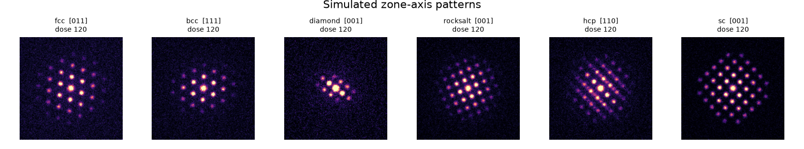
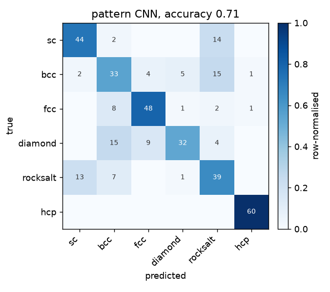
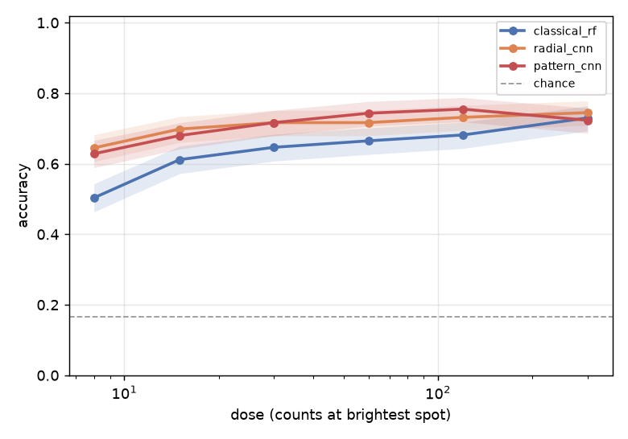

# diffraction-structure-classifier

Identify the crystal structure type behind a simulated electron diffraction
pattern. The repository ships a kinematical diffraction simulator with exact
ground truth, three classifiers on three different views of the same pattern (a
fair-tuned classical baseline, a 1D CNN on the radial profile, and a 2D CNN on a
rotation-invariant polar-Fourier map), and a config-driven benchmark that
measures which representation wins, where each one fails, and how they hold up as
photons, reflections, and orientation degrade. Everything runs on CPU; every
committed number regenerates from a fixed-seed YAML config.

This is a reciprocal-space project. The data are diffraction patterns, not
real-space micrographs, and the task is classification, not detection.







## Headline results

Full tables and readings in [RESULTS.md](RESULTS.md); raw values in
`results/*.json`. Four findings, measured this session, not asserted (chance is
1/6 = 0.167):

**1. The 2D pattern CNN wins, and the gap is not a tuning artifact.** At a
moderate operating point (dose 40, 3 degrees of tilt, 85% of reflections), the
rotation-invariant polar-Fourier CNN reaches accuracy 0.711, against 0.658 for
the 1D radial CNN and 0.556 for the classical baseline. The classical baseline is
grid-search tuned, not left at defaults, and tuning does not help: the
cross-validation-optimal forest scores 0.542 versus 0.547 for the library
default, so the classical baseline sits near 0.55 either way. The 16-point gap to
the pattern CNN is a limit of the representation, not the hyperparameters.

| Method | Accuracy | Macro-F1 |
|---|---|---|
| classical random forest (tuned) | 0.556 | 0.541 |
| radial-profile CNN (1D) | 0.658 | 0.648 |
| **polar-Fourier CNN (2D)** | **0.711** | **0.712** |

**2. It is also the most robust to dose.** Across a 40x dose range the pattern
CNN holds accuracy 0.70 to 0.80, while the classical baseline swings from 0.55 to
0.72 and only catches up at the brightest setting.

| Dose (counts/spot) | classical | radial CNN | pattern CNN |
|---|---|---|---|
| 8 | 0.546 | 0.654 | **0.700** |
| 30 | 0.692 | 0.742 | **0.762** |
| 60 | 0.638 | 0.746 | **0.796** |
| 300 | 0.721 | 0.704 | **0.721** |

**3. Angular geometry is where 2D earns its keep: rock salt.** The radial profile
throws away the angular arrangement of spots, and it shows in the one structure
that differs from simple cubic mainly in that arrangement. The 2D CNN recovers
rock salt at recall 0.65 where the 1D CNN and the classical baseline both manage
0.38. HCP, the only hexagonal structure, is near-perfect for everyone (recall
0.92 to 1.00); diamond, an FCC lattice with extra absences, is the hardest for
all three.

**4. The models use the diffraction, not artifacts.** With the diffracted spots
blanked out (only the central beam and background left), every model drops to
chance (0.14 to 0.17), and models trained on blanked patterns or on shuffled
labels cannot beat chance either. A domain-randomisation ablation confirms that
holding the camera-length scale or the background fixed does not inflate accuracy.

## The six structures

Simple cubic, body-centred cubic, face-centred cubic, diamond cubic, rock salt,
and hexagonal close-packed. They are chosen to be genuinely confusable in the way
that matters: diamond and rock salt share the FCC lattice and differ only by
extra absences (diamond) or an alternation of strong and weak reflections (rock
salt), so separating them is a real test rather than a colour-by-numbers
exercise. HCP is the easy hexagonal case. The systematic absences that
distinguish the lattices are never hard coded; they fall out of the
structure-factor phase sum being zero, so the labels and the allowed reflections
come from the same first-principles calculation (`crystalclass.structures`).

## How the task is kept honest

A single-crystal zone-axis pattern depends on both the structure and the beam
direction, so the design keeps the class the only thing worth learning:

- **Image size is constant** (128 px) for every class, so it cannot be a cue.
- **The camera-length scale is randomised** per pattern, so the overall size of
  the pattern in pixels does not encode the class.
- **The background is randomised** per pattern, so a constant background cannot
  be a cue.
- **The lattice parameter is jittered** and the zone axis is drawn from the
  principal low-index set, so no single absolute measurement gives the answer.

Two controls check that the models actually obey this. A **leakage** benchmark
blanks the diffracted spots (leaving only the beam and background) and confirms
every model drops to the 1/6 chance level, and that a model trained on blanked
patterns, or on shuffled labels, cannot beat chance. An **ablation** retrains the
2D CNN with the scale or the background held fixed and confirms neither inflates
accuracy. Both live in `configs/`.

## What is in the box

**Simulator** (`crystalclass.sim`, `crystalclass.structures`): kinematical
zone-axis electron diffraction for six structure types. Reflections in the
zero-order Laue zone are enumerated from the reciprocal lattice, weighted by
`|F(hkl)|^2` with an electron scattering factor, projected onto the detector
plane, dimmed by a first-order excitation-error model for off-zone tilt, thinned
by a missing-reflection fraction, blurred to Gaussian spots, and given a
randomised two-term background and Poisson noise set by a dose parameter. Every
pattern carries its exact label and generative metadata, and a 1D radial profile.

**Classical baseline** (`crystalclass.classical`, `crystalclass.features`):
scale- and rotation-invariant features (a radial profile resampled onto `r / r1`,
ring-radius ratios and relative heights, and the multiplicity and angular
regularity of the inner spot ring) fed to a random forest tuned by
cross-validated grid search. The comparison is against a *tuned* baseline, not a
default one.

**Learned models** (`crystalclass.net`, `crystalclass.train`): a 1D CNN over the
radial profile and a 2D CNN over the polar-Fourier map. The polar-Fourier map
resamples the pattern to polar coordinates and takes the FFT magnitude along the
angular axis, so an in-plane rotation leaves it unchanged while the angular
symmetry order, four-fold versus six-fold, is preserved. Committed weights are
small; both train in minutes on CPU.

**Benchmark harness** (`crystalclass.benchmark`): four modes driven by YAML
configs with fixed seeds: parameter sweeps (dose, visible reflections,
orientation spread), a full-confusion comparison with the classical fair-tuning
check, the leakage control, and the domain-randomisation ablation. The six
committed configs regenerate every figure and table here.

## Install

Python 3.11. CPU-only PyTorch is sufficient.

```
python -m venv .venv
.venv\Scripts\activate          # Windows; source .venv/bin/activate elsewhere
pip install torch --index-url https://download.pytorch.org/whl/cpu
pip install -e ".[dev]"
```

## Quickstart

```
crystalclass gallery                                  # labelled gallery of the six structures
crystalclass simulate --structure diamond --dose 120 --figure diamond.png
crystalclass demo                                     # classify the 6 committed samples
crystalclass benchmark configs/dose_sweep.yaml        # any committed benchmark
crystalclass train --model pattern                    # retrain the 2D CNN, minutes on CPU
```

Reproduce everything (samples, models, benchmarks, metrics, figures) with:

```
python scripts/run_all.py
```

The tutorial notebook (`notebooks/tutorial.ipynb`, committed executed) walks from
one simulated pattern through noise, orientation, and missing reflections to a
scored classifier, with a figure at every step. The Python API is documented with
runnable examples in [docs/api.md](docs/api.md); the models are documented in
[models/MODEL_CARD.md](models/MODEL_CARD.md).

## Real patterns

`crystalclass classify your_pattern.png --method pattern` runs on any single-crystal
zone-axis pattern whose direct beam is centred (see `crystalclass/real.py` for the
requirements). There is no ground truth for an arbitrary image, so the output is a
predicted structure and class probabilities, not an accuracy. No real diffraction
image is committed; the bring-your-own path is documented in
[data/README.md](data/README.md), and the synthetic-to-real domain gap is described
honestly in the model card.

## Repository layout

```
src/crystalclass/   structures, sim, features, classical, net, train, benchmark, metrics, plots, real, io, cli
configs/            six YAML benchmark configs, fixed seeds
models/             committed pattern CNN, radial CNN, tuned random forest + model card
data/sample/        six committed synthetic samples with ground truth
notebooks/          executed tutorial notebook
docs/               API documentation
figures/, results/  regenerable outputs of the committed configs
scripts/            run_all, make_figures, build_notebook
tests/              pytest suite
```

## Scope and limitations

- The imaging model is **kinematical** (single scattering) with a Gaussian spot
  shape and a first-order excitation-error model. Real patterns add dynamical
  (multiple) scattering, higher-order Laue zones, inelastic background, and
  detector effects. The benchmark measures classifier behaviour within this
  model; absolute numbers will not transfer to an instrument.
- The atomic scattering factor is a single Gaussian linear in Z. It reproduces
  the systematic absences exactly (those come from the structure-factor phase
  sum, not the factor's shape), but it exaggerates the intensity contrast between
  species relative to real electron scattering factors, most visibly the rock
  salt strong/weak alternation. The direct beam is likewise capped at the
  brightest diffracted spot rather than dominating as it would on an instrument;
  it is masked before classification, so this does not affect the results.
- Only six structure types down principal low-index zone axes are considered.
  Multi-phase or textured samples, arbitrary orientations, and convergent-beam
  patterns are out of scope.
- The models were trained purely on simulation and have never seen a real
  pattern; treat any prediction on experimental data as a hypothesis to check.
- The excitation-error model is first order in the tilt and documented in
  `crystalclass/sim.py`.

## Author

Aamir Malik

- GitHub: https://github.com/aamirmalik-dr
- LinkedIn: https://linkedin.com/in/dr-aamirmalik

## License

MIT for all code and synthetic data. See [LICENSE](LICENSE).
